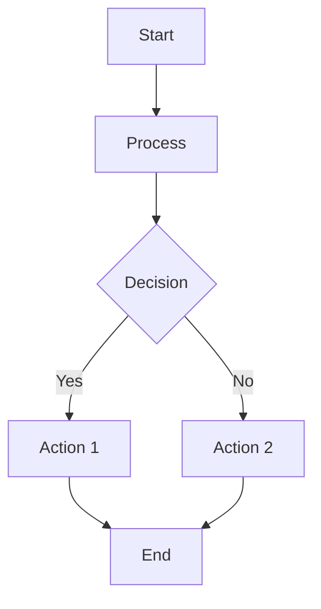
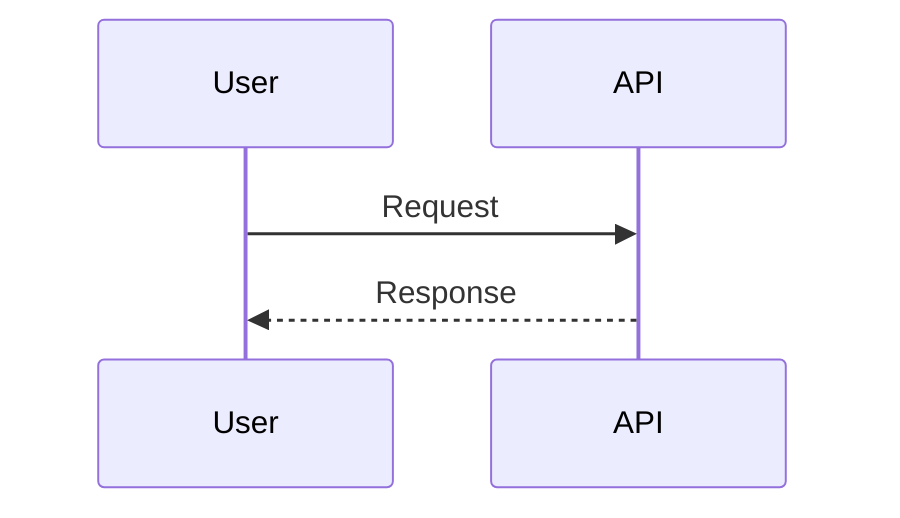
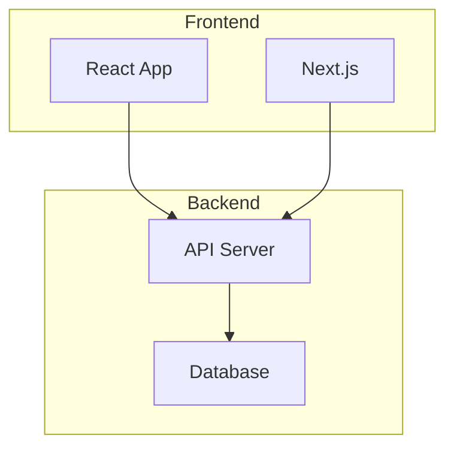

# How to Use createRepositoryMermaid Tool

## Quick Start

### Basic Usage
```json
{
  "name": "createRepositoryMermaid",
  "arguments": {
    "repositoryId": "692a91e7-8451-4ea0-88da-a0f56de86533",
    "title": "System Architecture",
    "content": "flowchart TD\n    A[Frontend] --> B[Backend]"
  }
}
```

## Required Parameters

1. **`repositoryId`** (string, required)
   - The ID of the repository where the diagram will be created
   - Example: `"692a91e7-8451-4ea0-88da-a0f56de86533"`

2. **`title`** (string, required)
   - Title of the Mermaid diagram
   - Example: `"System Architecture"` or `"User Flow Diagram"`

3. **`content`** (string, required)
   - The actual Mermaid diagram code/syntax
   - Must be valid Mermaid syntax
   - Example: `"flowchart TD\n    A[Start] --> B[End]"`

## Optional Parameters

4. **`description`** (string, optional)
   - Description of what the diagram represents
   - Example: `"Shows the overall system architecture"`

5. **`category`** (string, optional, default: "custom")
   - Category of the diagram
   - Options: `"architecture"`, `"workflow"`, `"database"`, `"custom"`
   - Example: `"architecture"`

6. **`tags`** (array of strings, optional)
   - Tags for categorizing and searching
   - Example: `["architecture", "system", "backend"]`

7. **`fileName`** (string, optional)
   - Custom file name (auto-generated from title if not provided)
   - Example: `"system-architecture.mermaid"`

## Mermaid Syntax Examples

### Flowchart


**Content parameter:**
```
"flowchart TD\n    A[Start] --> B[Process]\n    B --> C{Decision}\n    C -->|Yes| D[Action 1]\n    C -->|No| E[Action 2]\n    D --> F[End]\n    E --> F"
```

### Sequence Diagram


**Content parameter:**
```
"sequenceDiagram\n    participant A as User\n    participant B as API\n    A->>B: Request\n    B-->>A: Response"
```

### Architecture Diagram


**Content parameter:**
```
"graph TB\n    subgraph Frontend\n        A[React App]\n        B[Next.js]\n    end\n    subgraph Backend\n        C[API Server]\n        D[Database]\n    end\n    A --> C\n    B --> C\n    C --> D"
```

## Complete Examples

### Example 1: Simple Flowchart
```json
{
  "name": "createRepositoryMermaid",
  "arguments": {
    "repositoryId": "692a91e7-8451-4ea0-88da-a0f56de86533",
    "title": "User Registration Flow",
    "content": "flowchart TD\n    A[User Clicks Register] --> B[Fill Form]\n    B --> C{Valid?}\n    C -->|Yes| D[Create Account]\n    C -->|No| E[Show Errors]\n    D --> F[Success]",
    "category": "workflow",
    "description": "Shows the user registration process",
    "tags": ["workflow", "user", "registration"]
  }
}
```

### Example 2: Architecture Diagram
```json
{
  "name": "createRepositoryMermaid",
  "arguments": {
    "repositoryId": "692a91e7-8451-4ea0-88da-a0f56de86533",
    "title": "System Architecture",
    "content": "graph TB\n    subgraph Client\n        A[Web App]\n        B[Mobile App]\n    end\n    subgraph API\n        C[REST API]\n        D[GraphQL API]\n    end\n    subgraph Services\n        E[Auth Service]\n        F[Data Service]\n    end\n    subgraph Storage\n        G[(PostgreSQL)]\n        H[(Redis)]\n    end\n    A --> C\n    B --> D\n    C --> E\n    C --> F\n    D --> F\n    E --> G\n    F --> G\n    F --> H",
    "category": "architecture",
    "description": "Complete system architecture overview",
    "tags": ["architecture", "system", "design"]
  }
}
```

### Example 3: Database Schema
```json
{
  "name": "createRepositoryMermaid",
  "arguments": {
    "repositoryId": "692a91e7-8451-4ea0-88da-a0f56de86533",
    "title": "Database Schema",
    "content": "erDiagram\n    USER ||--o{ ORDER : places\n    ORDER ||--|{ ORDER_ITEM : contains\n    PRODUCT ||--o{ ORDER_ITEM : \"ordered in\"\n    USER {\n        string id\n        string email\n        string name\n    }\n    ORDER {\n        string id\n        date created_at\n        string status\n    }",
    "category": "database",
    "description": "Database entity relationship diagram",
    "tags": ["database", "schema", "er-diagram"]
  }
}
```

## Common Issues and Solutions

### Issue 1: Tool Not Being Called
**Problem:** AI calls `createSnippet` or `createRepositoryFile` instead

**Solution:**
- Be explicit: Say "Create a Mermaid diagram" not just "Create a diagram"
- Mention "Mermaid" specifically in your request
- Include the diagram type: "architecture diagram", "workflow diagram", etc.

**Example Request:**
- ✅ "Create a Mermaid diagram showing the system architecture"
- ✅ "Generate a Mermaid flowchart for the user registration process"
- ❌ "Create a diagram" (too vague)
- ❌ "Save a diagram file" (might use createRepositoryFile)

### Issue 2: Invalid Mermaid Syntax
**Problem:** Content parameter contains invalid Mermaid code

**Solution:**
- Validate Mermaid syntax before calling
- Use proper Mermaid keywords (flowchart, graph, sequenceDiagram, etc.)
- Ensure proper indentation and line breaks (\n)

### Issue 3: Tool Not Found
**Problem:** "Tool not found: createRepositoryMermaid"

**Solution:**
1. Verify tool is registered:
   ```bash
   grep "createRepositoryMermaid" src/tools/tool-registry.ts
   ```

2. Restart MCP server:
   ```bash
   npm run dev
   ```

3. Check tool list:
   ```bash
   curl -X POST "http://localhost:3111/mcp" \
     -H "Content-Type: application/json" \
     -d '{"jsonrpc":"2.0","id":1,"method":"tools/list","params":{}}' \
     | jq '.result.tools[] | select(.name | contains("Mermaid"))'
   ```

## Testing

### Test Script
```bash
# Run direct test
./scripts/test-mermaid-tool-direct.sh [repository-id]
```

### Manual Test via curl
```bash
curl -X POST "http://localhost:3111/mcp" \
  -H "Content-Type: application/json" \
  -H "Authorization: Bearer YOUR_API_KEY" \
  -d '{
    "jsonrpc": "2.0",
    "id": 1,
    "method": "tools/call",
    "params": {
      "name": "createRepositoryMermaid",
      "arguments": {
        "repositoryId": "YOUR_REPO_ID",
        "title": "Test Diagram",
        "content": "flowchart TD\n    A[Start] --> B[End]",
        "category": "architecture"
      }
    }
  }'
```

## Best Practices

1. **Always specify repositoryId** - Required for all operations
2. **Use descriptive titles** - Makes diagrams easier to find
3. **Choose appropriate category** - Helps with organization
4. **Add relevant tags** - Improves searchability
5. **Validate Mermaid syntax** - Test syntax before calling tool
6. **Use proper line breaks** - Use `\n` for multi-line diagrams

## Tool Comparison

| Tool | Use Case | Content Type |
|------|----------|--------------|
| `createRepositoryMermaid` | Mermaid diagrams | Mermaid syntax code |
| `createSnippet` | Code snippets | Programming code |
| `createRepositoryFile` | Files (markdown, text, etc.) | File content |

**Key Difference:** 
- `createRepositoryMermaid` is specifically for Mermaid diagrams
- `createSnippet` is for code snippets
- `createRepositoryFile` is for general files

## Verification

After creating a diagram, verify it was created:

```bash
# List diagrams
curl -X POST "http://localhost:3111/mcp" \
  -H "Content-Type: application/json" \
  -d '{
    "jsonrpc": "2.0",
    "id": 1,
    "method": "tools/call",
    "params": {
      "name": "listRepositoryMermaid",
      "arguments": {
        "repositoryId": "YOUR_REPO_ID"
      }
    }
  }'
```

---

**Tool Name:** `createRepositoryMermaid`  
**Endpoint:** `POST /api/repositories/{repositoryId}/mermaid`  
**Status:** ✅ Implemented and registered
