# Mermaid Diagrams & Snippet Ordering Improvements

## ✅ Changes Implemented

### 1. **Snippet Creation Moved to Last Step** ✅

**Problem:** For large codebases (600+ snippets), snippet creation was happening throughout the process, blocking other critical data from being saved.

**Solution:** All snippet creation is now consolidated into **Step 11** (the very last step), ensuring:
- ✅ All documentation is saved first
- ✅ All Mermaid diagrams are saved first
- ✅ All routes and folder structures are saved first
- ✅ Snippets are created last (even if it takes a long time)

**New Order:**
1. Ensure repository exists
2. Ensure project exists
3. Save README and documentation files
4. **Generate and save Mermaid diagrams** (NEW - Step 3.5)
5. Save coding standards
6. Save routes/API endpoints
7. Save folder structure
8. Save comprehensive analysis
9. Save main documentation
10. Save markdown document
11. Save comprehensive summary
12. **Save ALL code snippets** (MOVED HERE - Step 11)

### 2. **Mermaid Diagram Generation** ✅

**New Feature:** Automatic generation of Mermaid diagrams for codebase visualization.

#### Generated Diagrams:

1. **Folder Structure Diagram** (Tree)
   - Visual representation of the entire folder hierarchy
   - Shows files and directories with icons
   - Includes language information for files

2. **File Dependency Graph**
   - Shows import/export relationships between files
   - Visualizes module dependencies
   - Helps understand code flow

3. **Architecture Layers Diagram**
   - Visualizes architectural layers (presentation, application, infrastructure, core, etc.)
   - Shows relationships between layers
   - Includes architecture patterns

4. **Module Dependency Diagram**
   - Simplified view of major modules
   - Shows module relationships
   - Groups files by directory

#### When Generated:
- **Early in the process** (Step 3.5)
- Before snippet creation
- Saved as markdown documents with Mermaid syntax
- Can be rendered in any Markdown viewer that supports Mermaid

#### Saved As:
- Markdown documents with `document_type: "mermaid-diagram"`
- Tagged with: `mermaid`, `diagram`, `[diagram-type]`
- File path: `/repositories/{repo-name}/diagrams/{type}.md`

### 3. **Snippet Creation Improvements** ✅

**Changes:**
- All snippets now created in a single batch at the end
- Progress logging every 50 snippets
- No limits on important functions (removed 100 function limit)
- Better error handling - continues even if individual snippets fail

**Snippet Types Created:**
1. Utility functions (all)
2. Important functions (handlers, services, components, exported functions)
3. Routes configuration (as JSON snippet)
4. Key code files (top 20 files with classes/functions/interfaces)

## 📊 Benefits

### For Large Codebases:
- ✅ Critical data (docs, diagrams, routes) saved first
- ✅ Snippet creation doesn't block other operations
- ✅ Better progress visibility
- ✅ Can resume/retry snippet creation if needed

### For Code Understanding:
- ✅ Visual diagrams help understand structure
- ✅ Dependency graphs show relationships
- ✅ Architecture diagrams show layers
- ✅ All diagrams saved early and accessible

## 🔧 Technical Details

### Mermaid Diagram Generation Methods:

1. `generateFolderStructureMermaid()` - Creates tree diagram
2. `generateDependencyMermaid()` - Creates dependency graph
3. `generateArchitectureMermaid()` - Creates architecture diagram
4. `generateModuleDependencyMermaid()` - Creates module diagram
5. `generateAllMermaidDiagrams()` - Orchestrates all diagram generation

### Diagram Format:
```markdown
# Repository Name - Diagram Type

```mermaid
graph TD
    root["📁 repo-name"]
    ...
```


```

### Snippet Creation Flow:
```typescript
// Step 11: Save ALL code snippets LAST
1. Utility functions → snippets
2. Important functions → snippets
3. Routes → JSON snippet
4. Key code files → snippets
```

## 📝 Usage

### Automatic:
Diagrams are automatically generated when using `analyzeAndSaveRepository` tool.

### Manual (Future):
A separate tool can be created to generate diagrams for specific folders:
```typescript
// Future: generateFolderMermaidDiagram(folderPath: string)
// This would analyze a specific folder and generate its diagram
```

## 🎯 Next Steps

1. **Test with large codebase** - Verify snippet ordering works correctly
2. **Add folder-specific diagram generation** - Create tool for specific folder analysis
3. **Enhance dependency graph** - Improve import/export detection
4. **Add more diagram types** - Component relationships, data flow, etc.

---

*Last Updated: 2025-12-23*


