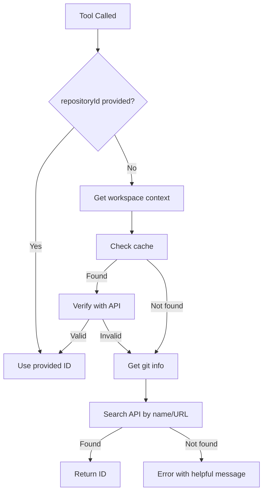

# Repository ID Auto-Detection Improvements

**Created:** 2025-12-25  
**Status:** ✅ Implementation Complete

## Overview

This document describes the improvements made to automatically detect and select the correct repository ID when it's not explicitly provided. This addresses the issue where tools sometimes selected incorrect repository IDs.

---

## Problem

Previously, all repository tools required a `repositoryId` parameter. When not provided or incorrectly provided, tools would fail or operate on the wrong repository. This was especially problematic when:
- Users forgot to provide the repository ID
- The AI assistant selected the wrong repository ID
- Multiple repositories with similar names existed

---

## Solution

### 1. Repository Detector Utility

Created `src/core/repository-detector.ts` with intelligent repository detection:

**Detection Priority:**
1. **Cache Lookup** - Check local cache for repository ID by:
   - Workspace path
   - Repository name
2. **Git Repository Detection** - Extract from workspace:
   - Git remote URL (origin)
   - Repository name from remote URL
   - Workspace directory name (fallback)
3. **API Search** - Search external API by:
   - Exact repository name match
   - Remote URL match (in description)
   - Workspace name match
   - Single result (if only one match)

### 2. Base Tool Handler Enhancement

Added `resolveRepositoryId()` method to `BaseToolHandler`:
- Automatically detects repository ID when not provided
- Provides helpful error messages when detection fails
- Logs auto-detection for debugging

### 3. Tool Updates

Updated all repository tools to:
- Make `repositoryId` parameter **optional**
- Auto-detect when not provided
- Provide better descriptions guiding users
- Show helpful error messages when detection fails

---

## Implementation Details

### Repository Detection Flow



### Code Pattern

All repository tools now follow this pattern:

```typescript
// Make repositoryId optional
paramsSchema = z.object({
  repositoryId: z.string().optional().describe(
    "The ID of the repository. If not provided, will be auto-detected from workspace context."
  ),
  // ... other params
});

async execute(params: Params): Promise<FormattedResponse> {
  const { startTime } = this.logStart(this.name, params);
  
  try {
    const apiService = this.getApiService();
    
    // Auto-detect repository ID if not provided
    const repositoryId = await this.resolveRepositoryId(params.repositoryId);
    
    // Use repositoryId in API calls
    const result = await apiService.get(`/api/repositories/${repositoryId}/...`);
    // ...
  }
}
```

---

## Detection Methods

### 1. Cache-Based Detection

Checks local repository cache for:
- Repository ID stored with workspace path
- Repository ID stored with repository name

**Advantages:**
- Fast (no API call needed)
- Works offline
- Accurate for previously analyzed repositories

### 2. Git-Based Detection

Extracts repository information from git:
- Remote URL: `git config --get remote.origin.url`
- Repository name: Extracted from remote URL or directory name
- Normalizes SSH URLs to HTTPS format

**Example:**
```
git@github.com:user/repo.git → https://github.com/user/repo
```

### 3. API Search

Searches external API with multiple strategies:
1. **Exact name match** - Finds repository with exact name
2. **Remote URL match** - Finds repository with matching remote URL in description
3. **Workspace name match** - Finds repository matching workspace directory name
4. **Single result** - If only one result, uses it

**Fallback:** Returns first match if multiple results found

---

## Updated Tools

### Errors API (5 tools)
- ✅ `createRepositoryError` - Updated
- ⏳ `listRepositoryErrors` - Needs update
- ⏳ `getRepositoryError` - Needs update
- ⏳ `updateRepositoryError` - Needs update
- ⏳ `deleteRepositoryError` - Needs update

### Learnings API (5 tools)
- ⏳ `createRepositoryLearning` - Needs update
- ⏳ `listRepositoryLearnings` - Needs update
- ⏳ `getRepositoryLearning` - Needs update
- ⏳ `updateRepositoryLearning` - Needs update
- ⏳ `deleteRepositoryLearning` - Needs update

### Patterns API (5 tools)
- ⏳ `createRepositoryPattern` - Needs update
- ⏳ `listRepositoryPatterns` - Needs update
- ⏳ `getRepositoryPattern` - Needs update
- ⏳ `updateRepositoryPattern` - Needs update
- ⏳ `deleteRepositoryPattern` - Needs update

**Note:** Pattern established in `createRepositoryError`. Other tools can be updated following the same pattern.

---

## Benefits

1. **Better User Experience**
   - No need to manually provide repository ID
   - Works automatically in most cases
   - Clear error messages when detection fails

2. **Improved Accuracy**
   - Uses multiple detection methods
   - Prioritizes cache (most accurate)
   - Falls back to API search

3. **Developer Friendly**
   - Simple pattern to follow
   - Centralized detection logic
   - Easy to debug with logging

4. **Backward Compatible**
   - Still accepts explicit repositoryId
   - Existing code continues to work
   - Optional parameter doesn't break anything

---

## Error Handling

When auto-detection fails, users get helpful error messages:

```
Could not auto-detect repository ID. Please provide repositoryId parameter 
or ensure you're in a git repository with a remote URL configured. 
You can also use listRepositories tool to find the correct repository ID.
```

This guides users to:
1. Provide repositoryId explicitly
2. Check git configuration
3. Use listRepositories tool to find the ID

---

## Usage Examples

### Before (Required repositoryId)
```typescript
// Had to provide repositoryId
createRepositoryError({
  repositoryId: "85c5d8c8-7679-41e2-a8a5-f9ab364b3326",
  errorName: "Module Error",
  errorMessage: "Cannot find module"
})
```

### After (Auto-detected)
```typescript
// Auto-detects from workspace
createRepositoryError({
  errorName: "Module Error",
  errorMessage: "Cannot find module"
})
```

### Explicit (Still works)
```typescript
// Can still provide explicitly if needed
createRepositoryError({
  repositoryId: "85c5d8c8-7679-41e2-a8a5-f9ab364b3326",
  errorName: "Module Error",
  errorMessage: "Cannot find module"
})
```

---

## Testing

To test auto-detection:

1. **In a git repository:**
   ```bash
   cd /path/to/git/repo
   # Tool will auto-detect from git remote
   ```

2. **With cache:**
   ```bash
   # After running analyzeAndSaveRepository
   # Tools will use cached repository ID
   ```

3. **Manual override:**
   ```typescript
   // Provide repositoryId explicitly
   // Takes precedence over auto-detection
   ```

---

## Future Improvements

1. **Repository Selection UI** - When multiple matches found, prompt user to select
2. **Workspace Configuration** - Allow users to configure default repository per workspace
3. **Repository Aliases** - Support short names/aliases for repositories
4. **Better Matching** - Use fuzzy matching for repository names
5. **Remote URL Validation** - Verify remote URL matches repository description

---

## Files Created/Modified

### New Files
- `src/core/repository-detector.ts` - Repository detection utility

### Modified Files
- `src/tools/base/tool-handler.base.ts` - Added `resolveRepositoryId()` method
- `src/tools/repositories/errors/create-repository-error.tool.ts` - Updated to use auto-detection

### Files to Update
- All other repository tools (errors, learnings, patterns) - Follow the same pattern

---

**Last Updated:** 2025-12-25

